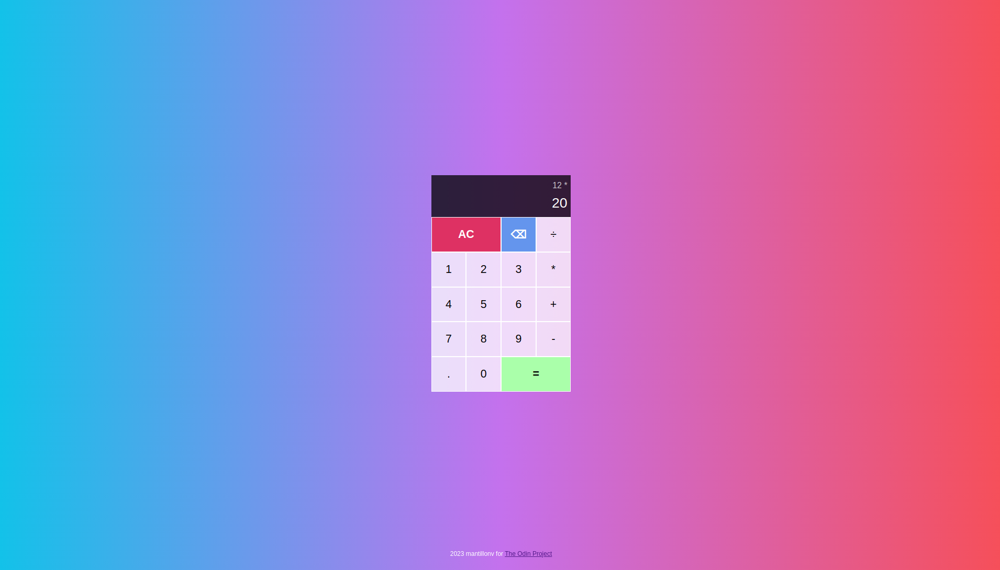

# JS-Calculator
JS/CSS/HTML On-screen calculator for TOP 🥷

TOP Foundations final project. Make an on-screen **Calculator** using JavaScript, HTML and CSS.

- Simple and elegant CSS styling.
- Functions for basic Math operators.
- Capable of handling decimal numbers.
- Limited keyboard support. 

<h2>Screenshot:</h2>
